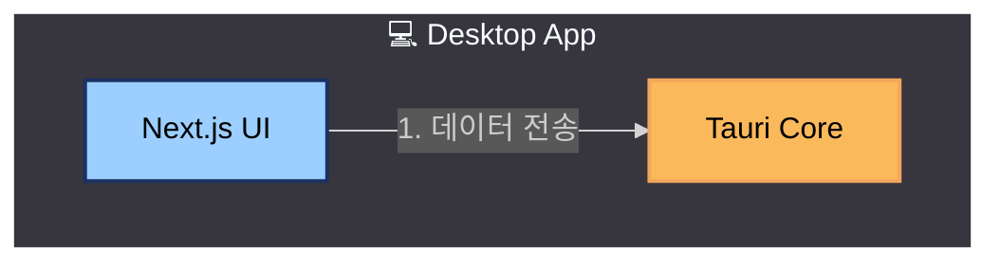
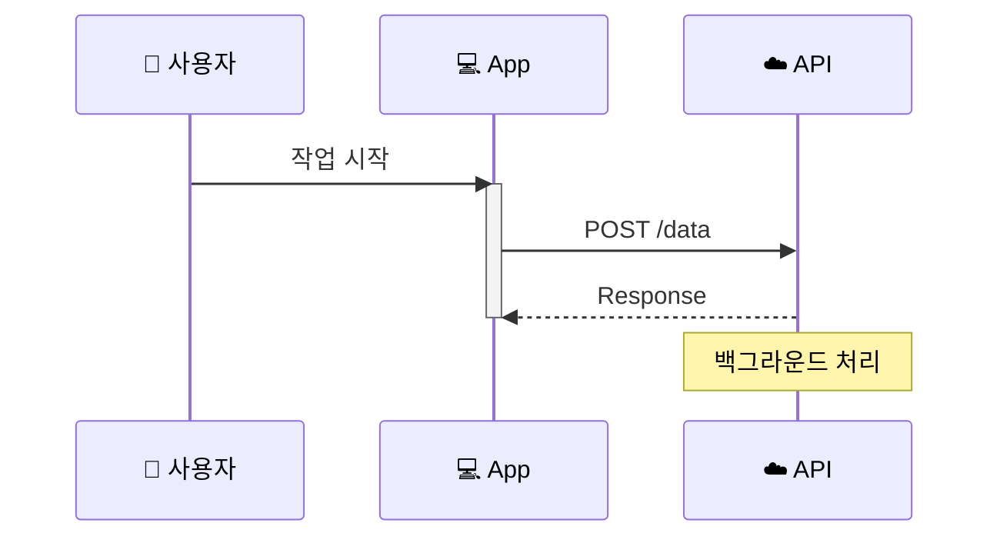

# Mermaid Diagram Creator

최신 Mermaid 문법을 사용하여 아키텍처, 데이터 흐름, 시스템 구조를 시각화하는 다이어그램을 생성합니다.

## 핵심 역할

1. **Mermaid MCP 활용**: 최신 문법 및 모범 사례 자동 참조
2. **아키텍처 시각화**: 시스템 구조, 계층형 아키텍처 도표 생성
3. **데이터 흐름 표현**: 시퀀스 다이어그램, 워크플로우 시각화
4. **컨텍스트별 저장**: `docs/report/<context>/` 구조로 체계적 관리

## 작업 흐름

### 1. Mermaid MCP로 최신 문법 확인

작업 시작 전 Mermaid MCP를 통해 최신 문법과 모범 사례를 확인합니다.

### 2. 다이어그램 유형 파악

사용자 요청에 따라 적절한 다이어그램 유형을 선택합니다:

- **flowchart** (플로우차트): 시스템 구조, 아키텍처, 프로세스 흐름
- **sequenceDiagram** (시퀀스): 데이터 흐름, API 호출, 상호작용 순서
- **gantt** (간트 차트): 일정, 로드맵, 타임라인
- **classDiagram** (클래스): 데이터 모델, 엔티티 관계

### 3. 아키텍처 도표 시 참조 차트 활용

아키텍처 개선안, 시스템 설계 도표 요청 시 `references/` 폴더의 예시 차트 패턴을 참조합니다:

- **02-recommended-architecture.mmd**: 계층형 아키텍처 (subgraph, 번호 화살표, 색상 스타일)
- **03-data-flow.mmd**: 시퀀스 다이어그램 (participant, loop, Note, 이모지)

### 4. 다이어그램 생성

다음 스타일 가이드를 따릅니다:

#### 색상 규칙 (필수)

**블록 텍스트 색상**:
- 모든 노드의 텍스트는 **검은색**(`color:#000`) 사용
- 가독성을 위해 밝은 배경색과 대비

**전체 테마 및 Subgraph 배경색**:
- 전체 테마: `dark` (다크 배경 유지)
- Subgraph 배경색: `#37353E` (다크 그레이)
- 모든 subgraph에 일관되게 적용
- 다이어그램 최상단에 테마 설정 추가:
  ```
  %%{init: {'theme':'dark', 'themeVariables': { 'clusterBkg':'#37353E', 'clusterBorder':'#37353E'}}}%%
  ```

**블록 배경색 팔레트**:
다음 색상 중에서 선택하여 사용:
```
#FF5B5B  #F0FFC3  #9CCFFF  #685AFF  #1A3263
#547792  #FAB95B  #E8E2DB  #6F8F72  #F2A65A
#36656B  #75B06F  #DAD887  #F0F8A4  #3F9AAE
#79C9C5  #FFE2AF  #F96E5B  #5A7ACD  #FACE68
#CFADC1
```

**색상 적용 예시**:
```mermaid
style NodeName fill:#9CCFFF,stroke:#1A3263,stroke-width:2px,color:#000
```

**권장 조합**:
- 파랑 계열: `#9CCFFF` (fill) + `#1A3263` (stroke)
- 주황 계열: `#FAB95B` (fill) + `#F2A65A` (stroke)
- 초록 계열: `#75B06F` (fill) + `#6F8F72` (stroke)
- 보라 계열: `#685AFF` (fill) + `#5A7ACD` (stroke)
- 빨강 계열: `#FF5B5B` (fill) + `#F96E5B` (stroke)

#### 플로우차트 (Flowchart)
- **subgraph** 활용: 논리적 그룹핑 (Desktop, Cloud, Database 등)
- **이모지 사용**: 컴포넌트 식별력 향상 (💻, ☁️, 🗄️, 💬 등)
- **화살표 번호**: 데이터 흐름 순서 명시 (`-->|1. 녹화 데이터|`)
- **색상 적용**: 팔레트 색상 사용, 텍스트는 검은색

예시:


#### 시퀀스 다이어그램 (Sequence)
- **participant**: 이모지로 주체 명시 (👤 사용자, 💻 클라이언트, ☁️ 서버)
- **loop/alt**: 반복/조건부 로직 표현
- **Note**: 중요한 설명 추가
- **activate/deactivate**: 프로세스 활성화 표시

예시:


### 5. 저장 및 README 관리

#### 저장 경로
`docs/report/<context>/<name>.mmd` 형식으로 저장합니다.

예시:
- `docs/report/slack-bot/02-recommended-architecture.mmd`
- `docs/report/api-refactor/01-current-problems.mmd`

#### README.md 업데이트
해당 폴더의 README.md에 새 차트를 추가합니다. 기존 README가 없으면 생성합니다.

포함 내용:
- 다이어그램 제목 및 설명
- 다이어그램 타입 (flowchart, sequenceDiagram 등)
- 주요 내용 요약
- 사용법 (Mermaid Live Editor 링크 등)

## 참조 차트

### 02-recommended-architecture.mmd
**타입**: Flowchart (Graph TB)

**주요 패턴**:
- 4개 레이어 구조 (Desktop, Cloud, Data, Integration)
- subgraph로 논리적 그룹핑
- 12단계 데이터 흐름 화살표 (`-->|1. 녹화|`, `-->|2. 업로드|`)
- 색상 스타일로 컴포넌트 강조
- 이모지 활용 (💻, ☁️, 🗄️, 💬)

### 03-data-flow.mmd
**타입**: Sequence Diagram

**주요 패턴**:
- participant에 이모지 (👤 사용자, 💻 Tauri, ☁️ FastAPI)
- loop 블록 (반복 처리 표현)
- Note over (백그라운드 프로세스 설명)
- activate/deactivate (프로세스 활성화 표시)

## 체크리스트

다이어그램 생성 후 다음을 확인합니다:

- [ ] Mermaid MCP로 최신 문법 검증
- [ ] 적절한 다이어그램 타입 선택
- [ ] 이모지 및 색상 스타일 적용
- [ ] **블록 텍스트 색상 검은색 적용** (`color:#000`)
- [ ] **팔레트 색상 사용** (제공된 21개 색상 중 선택)
- [ ] **Subgraph 배경색 #37353E 적용** (다이어그램 최상단에 테마 설정 추가)
- [ ] 화살표에 번호 또는 레이블 추가 (플로우차트)
- [ ] `docs/report/<context>/<name>.mmd` 경로에 저장
- [ ] 해당 폴더의 README.md 업데이트

## 참고 자료

- **Mermaid Live Editor**: https://mermaid.live
- **Mermaid 공식 문서**: https://mermaid.js.org/
- **VS Code 확장**: Markdown Preview Mermaid Support
